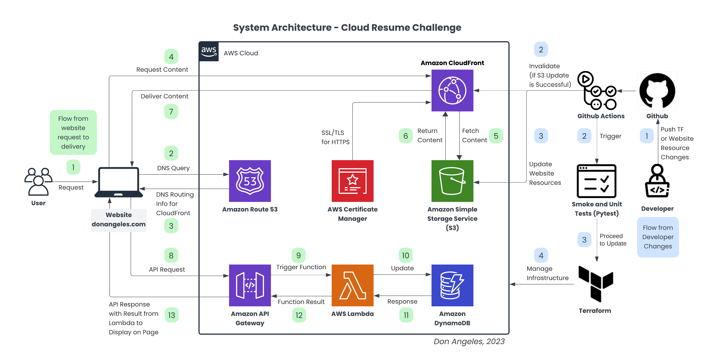

# **Cloud Resume Challenge**

This repository contains my implementation of the **[Cloud Resume Challenge](https://cloudresumechallenge.dev/instructions/)** by Forrest Brazeal.

The challenge involves building a static resume website hosted in AWS using infrastructure as code. I completed this challenge to demonstrate expertise with:

- Infrastructure as Code (IaC) concepts using Terraform
- Deploying AWS infrastructure including S3, CloudFront, Lambda, API Gateway, DynamoDB
- Implementing a CI/CD pipeline with GitHub Actions
- Securing AWS resources and minimizing costs

## **Website Architecture**

The resume website is hosted in an S3 bucket that is distributed globally using CloudFront. Visitors are tracked using a Lambda function writing to DynamoDB. The API backend is implemented via API Gateway endpoints running Lambda functions.

The following components are provisioned:

- S3 bucket for hosting static resume website files
- CloudFront distribution accessing the S3 origin
- Lambda functions for visitor tracking APIs
- API Gateway for Lambda API endpoints
- DynamoDB table for tracking website visitors

Terraform is used to declaratively provision all AWS infrastructure.