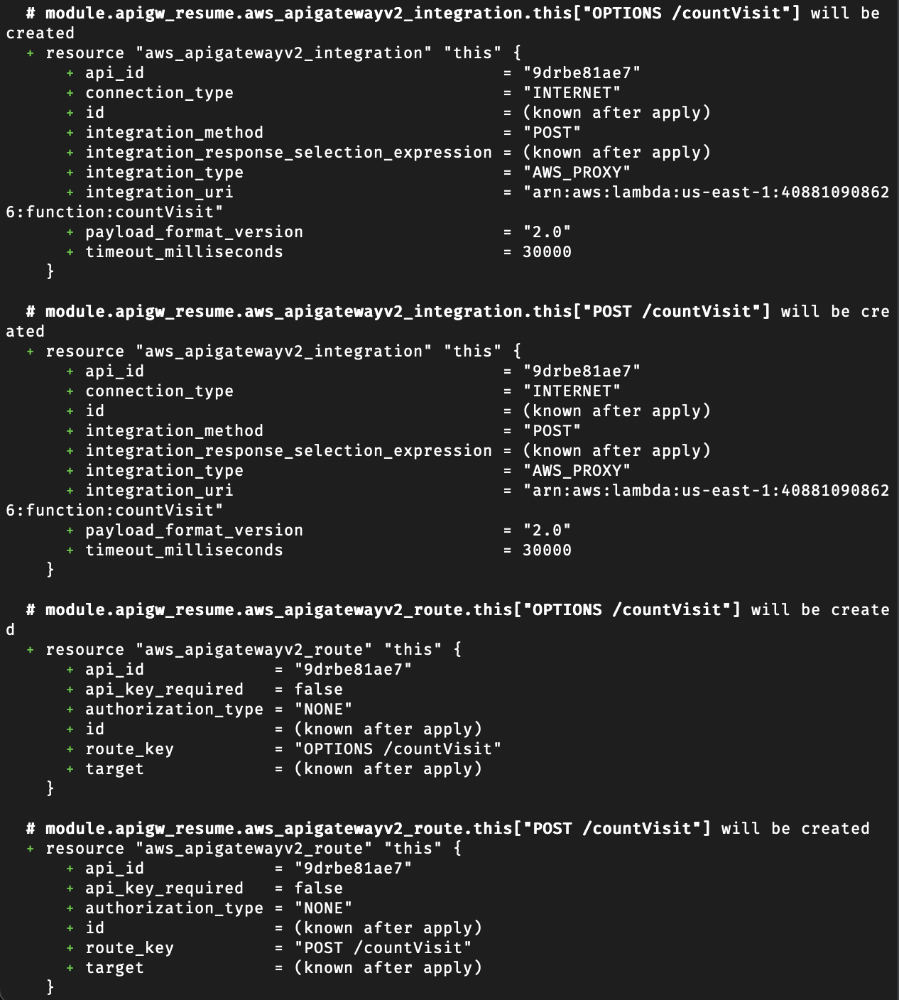

# Import Resources Notes

This contains code that was used to import AWS resources into Terraform. Most resources were imported into AWS modules from the registry.

## Import Blocks to Generate Resource Blocks

```hcl
import {
    to = aws_s3_bucket.resume_bucket
    id = "cloudresume-don"
}

import {
    to = aws_dynamodb_table.visit_counter
    id = "visitCounter"
}

import {
    to = aws_cloudfront_distribution.cf_distribution
    id = "ER0K5G3S0PD5R"
}

import {
    to = aws_apigatewayv2_api.apigw
    id = "9drbe81ae7"
}

import {
    to = aws_lambda_function.lambda_update_count
    id = "countVisit"
}
```

**Run `terraform plan -generate-config-out=generated_resources.tf`** to generate resource blocks.

The above was also necessary to see which attributes were being imported by Terraform. The values `id` arguments were retrieved usin the CLI or the console.

## Importing into Modules

Note that each import block has module blocks associated with it.

```hcl
import {
  to = module.resume_bucket.aws_s3_bucket.this[0]
  id = "cloudresume-don"
}

module "resume_bucket" {
  source = "terraform-aws-modules/s3-bucket/aws"
  bucket = "cloudresume-don"

  # Versioning to be enabled once VC is setup.
  versioning = {
    enabled    = false
    mfa_delete = false
  }
}

import {
  to = module.resume_bucket.aws_s3_bucket_versioning.this[0]
  id = "cloudresume-don"
}

import {
  to = module.cloudfront_resume.aws_cloudfront_distribution.this[0]
  id = "ER0K5G3S0PD5R"
}

module "cloudfront_resume" {
  source              = "terraform-aws-modules/cloudfront/aws"
  aliases             = ["*.donangeles.com", "donangeles.com"]
  comment             = null
  default_root_object = "index.html"
  enabled             = true
  http_version        = "http2and3"
  is_ipv6_enabled     = true
  price_class         = "PriceClass_All"
  retain_on_delete    = false
  wait_for_deployment = true
  web_acl_id          = null

  # Origin configuration pointing to the S3 bucket
  origin = {
    content = {
      domain_name              = "cloudresume-don.s3.us-east-1.amazonaws.com"
      origin_access_control_id = "E2RU6J1N6S39CV"
      origin_id                = "cloudresume-don.s3-website-us-east-1.amazonaws.com"
    }
  }

  # Default cache behavior settings
  default_cache_behavior = {
    allowed_methods        = ["GET", "HEAD"]
    cache_policy_id        = "658327ea-f89d-4fab-a63d-7e88639e58f6"
    cached_methods         = ["GET", "HEAD"]
    target_origin_id       = "cloudresume-don.s3-website-us-east-1.amazonaws.com"
    viewer_protocol_policy = "redirect-to-https"
    compress               = true
    use_forwarded_values   = false
  }

  # Viewer certificate configuration
  viewer_certificate = {
    acm_certificate_arn            = "arn:aws:acm:us-east-1:408810908626:certificate/90e8be72-67ba-4297-9d7f-31d095a46fbd"
    cloudfront_default_certificate = false
    iam_certificate_id             = null
    minimum_protocol_version       = "TLSv1.2_2021"
    ssl_support_method             = "sni-only"
  }
}


import {
  to = module.ddb_resume_table.aws_dynamodb_table.this[0]
  id = "visitCounter"
}

module "ddb_resume_table" {
  source = "terraform-aws-modules/dynamodb-table/aws"
  name   = "visitCounter"

  # Setting timeouts and tags explicitly to override module defaults
  timeouts = {}
  tags     = null
}

import {
  to = module.apigw_resume.aws_apigatewayv2_api.this[0]
  id = "9drbe81ae7"
}

module "ddb_resume_table" {
  source = "terraform-aws-modules/dynamodb-table/aws"
  name   = "visitCounter"

  # Setting timeouts and tags explicitly to override module defaults
  timeouts = {}
  tags     = null
}

# API Gateway Module Configuration
module "apigw_resume" {
  source = "terraform-aws-modules/apigateway-v2/aws"
  name   = "visitorCounterAPI"

  # CORS configuration for the API
  cors_configuration = {
    allow_headers = ["'content-type,x-amz-date,authorization,x-api-key,x-amz-security-token'"]
    allow_methods = ["POST", "OPTIONS", "GET"]
    allow_origins = ["https://www.donangeles.com", "https://donangeles.com"]
  }

  create_api_domain_name = false
  create_default_stage   = false


  # integrations = {

  #   "POST /countVisit" = {
  #     lambda_arn               = aws_lambda_function.lambda_update_count.arn
  #     connection_type               = "INTERNET"
  #     integration_type              = "AWS_PROXY"
  #     payload_format_version   = "2.0"
  #     timeout_milliseconds          = 30000
  #   }
  # }
}
```

Code below shows code ti import into a lambda module and then a resource block that was eventually used to import the existing lambda function.

Importing into the lambda module was not as straightforward as with other modules. There were some functionality differences but need to test again to output actual error/incompatibility.

```hcl
import {
  to = module.lambda_resume_update_counts.aws_lambda_function.this[0]
  id = "countVisit"
}

resource "aws_lambda_function" "lambda_update_count" {
  function_name = "countVisit"
  handler       = "lambda_function.lambda_handler"
  runtime       = "python3.9"
  role          = "arn:aws:iam::408810908626:role/lambda-ddb-visitcount"
  memory_size   = 128
  timeout       = 3
  package_type  = "Zip"
  #source_code_hash                   = "GpCmZ2hqv/4gy/RvyxrfWF2vq4r1wM6oo+k52y4OcrA="
  filename         = data.archive_file.update_count_zip.output_path         #"${path.module}/lambda_functions/update_count.zip" 
  source_code_hash = data.archive_file.update_count_zip.output_base64sha256 #filebase64sha256("${path.module}/lambda_functions/update_count.zip")

  # Additional configuration details
  architectures                  = ["x86_64"]
  reserved_concurrent_executions = -1
  ephemeral_storage {
    size = 512
  }
  tracing_config {
    mode = "PassThrough"
  }

}
```

---

## Changes made to allow only /POST method

**Performed November 29, 2023**

APIGW module resource already exists and need for TF to manage routes and integrations as well. Intend to remove /GET route to only enable /POST and /OPTIONS methods through the APIGW.

The following shows how to import into the APIGW module:
```bash
terraform import 'module.apigw_resume.aws_apigatewayv2_route.this["OPTIONS /countVisit"]' 9drbe81ae7/1ry1kis
terraform import 'module.apigw_resume.aws_apigatewayv2_route.this["POST /countVisit"]' 9drbe81ae7/325n1no
terraform import 'module.apigw_resume.aws_apigatewayv2_route.this["GET /countVisit"]' 9drbe81ae7/cc07fi2   

terraform import 'module.apigw_resume.aws_apigatewayv2_integration.this["GET /countVisit"]' 9drbe81ae7/2mk7eh1
terraform import 'module.apigw_resume.aws_apigatewayv2_integration.this["OPTIONS /countVisit"]' 9drbe81ae7/2mk7eh1
terraform import 'module.apigw_resume.aws_apigatewayv2_integration.this["POST /countVisit"]' 9drbe81ae7/2mk7eh1
```

Initially just tried to set `create_routes_and_integrations` to `true` but applying `plan` shows that the resources will be created.

```hcl
create_routes_and_integrations = true


integrations = {

  "POST /countVisit" = {
    lambda_arn             = aws_lambda_function.lambda_update_count.arn
    connection_type        = "INTERNET"
    integration_type       = "AWS_PROXY"
    payload_format_version = "2.0"
    timeout_milliseconds   = 30000
  }

  "OPTIONS /countVisit" = {
    lambda_arn             = aws_lambda_function.lambda_update_count.arn
    connection_type        = "INTERNET"
    integration_type       = "AWS_PROXY"
    payload_format_version = "2.0"
    timeout_milliseconds   = 30000
  }
}
```



Applying the imports first allows Terraform to recognize its current status and thus no changes were shown after `plan`.


